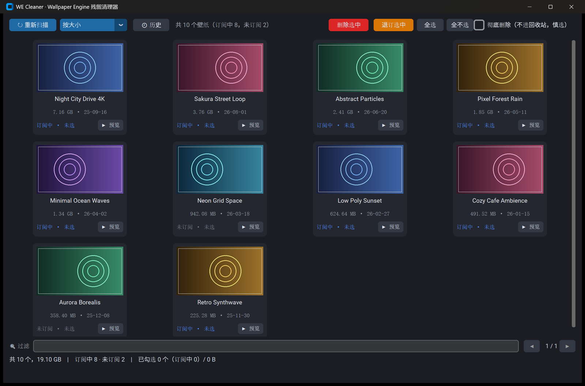

<div align="center">

# WE Cleaner

**Wallpaper Engine wallpaper manager & leftover cleaner**

See what every wallpaper costs you · batch-unsubscribe unwanted ones · restore what you deleted by accident

[](https://github.com/xiaoyuyu6420/wallpaper-engine-cleaner/releases/latest)
[](LICENSE)
[](https://github.com/xiaoyuyu6420/wallpaper-engine-cleaner/releases/latest)



[中文文档](README.md) · English

</div>

## The problem

Wallpaper Engine wallpapers are several GB each. Subscribe to a few dozen and you've silently lost 50–150 GB of disk space. Worse:

- **Unsubscribing often leaves files behind** — files stay on disk taking up space while being invisible in the client
- **No way to see which wallpaper is the biggest or when it was installed**
- **No batch unsubscribe** — removing wallpapers one by one in the client is painful
- **No undo** — unsubscribe by accident and the files are gone

WE Cleaner solves all four: a thumbnail card wall with exact sizes, batch unsubscribe through official Steam APIs, leftover cleanup, and a history log that can restore subscriptions with one click.

## Features

| Feature | Description |
|---|---|
| 🖼 **Thumbnail wall** | Preview image, title, size, install date and subscription status for every wallpaper |
| 🔍 **Search & sort** | Live filter by title/ID; sort by size or install time |
| ⚡ **Batch unsubscribe** | Select many, unsubscribe once — Steam deletes the files and cancels downloads automatically |
| 🧹 **Leftover cleanup** | Finds files from unsubscribed wallpapers that Steam failed to delete — without touching active subscriptions |
| 🕘 **History & restore** | Every unsubscribe/delete is logged; re-subscribe with one click and Steam re-downloads |
| 🎬 **Quick local preview** | Play a wallpaper's video without opening Wallpaper Engine |

## Quick start

1. Download `WECleaner.exe` from [Releases](https://github.com/xiaoyuyu6420/wallpaper-engine-cleaner/releases/latest) (portable, ~20 MB)
2. Keep **Steam running**, double-click the exe
3. Sort / search to find unwanted wallpapers → select → **Unsubscribe Selected**
4. Made a mistake? Open **🕘 History** → select → **Resubscribe** — Steam downloads them back

> Requires Windows 10/11 with Steam and Wallpaper Engine installed.

## CLI

```text
WECleaner scan                            # list all wallpapers (size/time/subscription status)
WECleaner unsubscribe --list              # read-only subscription listing
WECleaner unsubscribe --all               # unsubscribe everything
WECleaner clean --all -y                  # remove all unsubscribed leftovers (to Recycle Bin)
WECleaner history                         # view operation history
WECleaner resubscribe --all               # restore subscriptions from history
```

## Safety

- **Read-only mode when subscription state is unreliable** — never touches files without verified information
- **Delete and unsubscribe are physically separated** — deletions only ever target unsubscribed leftovers
- **Deletes go to the Recycle Bin by default**; permanent delete requires an explicit opt-in and a second confirmation
- **No account risk** — uses the official Steamworks `ISteamUGC` interface, the same channel the Wallpaper Engine client itself uses. No passwords, no injection, no hooks

## How it works

```text
Locate Steam and all game libraries (registry + libraryfolders.vdf)
        ↓
Read the authoritative subscription list (Steamworks ISteamUGC via the running Steam client)
        ↓
Diff against on-disk workshop content  →  "subscribed" vs "leftover" separated exactly
        ↓
Unsubscribe / clean / restore — all delegated to the Steam client
```

The tool borrows any installed game's `steam_api64.dll` and connects as Wallpaper Engine (AppID 431960) — the same channel the WE client uses for its own workshop operations.

## Build from source

Requires [uv](https://docs.astral.sh/uv/):

```bash
uv sync
uv run pyinstaller --onefile --clean --collect-all customtkinter --name WECleaner run.py
# output: dist/WECleaner.exe
```

Stack: Python 3.12 · CustomTkinter · Pillow · PyInstaller

## License

[MIT](LICENSE)
